# BLIND SPOT

A portrait mobile web prototype for the Meta Horizon Creator Competition (Tower Defense & Strategy).

**▶ Play the current build: https://jamesdavid.github.io/Blindspot/** (open on a phone, or a narrow browser window)

> **One camera, five jobs.** A single system carries the whole game — the pole-mounted camera. It is *evidence* (its plate reads build cases), *economy* (closures pay the budget), *territory* (its sightline is the only ground you hold), *liability* (a degraded camera keeps reporting — worse — and poisons your own case files), and *bait* (it teaches crews where not to drive, and it watches the vandals who come for its neighbours). The cameras never stop anyone. Pictures expire, crews learn, and both too little surveillance and too much get you relieved of duty. You are the analyst. Place the eyes.

**Tech:** Three.js / HTML5, single-player, portrait, fully offline. All entrant-authored code assembles into one readable `index.html`; Three.js lives under `/vendor`. All art is procedural Three.js geometry and all audio is runtime WebAudio synthesis — no external assets of any kind.

---

## Watch the network close the warrant

Six minutes of night work at timelapse: the **evolved champion** drives the real interface — menus open at its thumb, the button it means to press lights gold, ghosts walk CONFIRM — building nine cameras, weighing contested cards, dropping the bar when the rain comes, and serving the syndicate warrant on camera:

**▶ [Watch the full shift (mp4)](docs/media/shift_timelapse.mp4)**

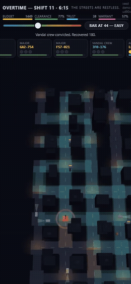

---

## Playing

Open the link above (or `index.html` from disk — no server or network needed) on a portrait phone or a narrow browser window.

- **Tap any intersection.** A context menu opens at your thumb, options in labelled category columns — **EYES** (Post / Long / Dome), **UPLINK** (Relay), **WORKS** (harden, storage, clean, relocate), **DIAL** — each button carrying its cost and a one-line explanation, with a ✕ to dismiss. Disabled buttons stay tappable and tell you *why* they refuse.
- **A ghost appears before you pay.** Its quality pill quotes the best and worst read the unit will get from that pole ("READS 92 BEST / 60 WORST · CLEAN") at the current bar. The Long aims with ↺ ↻ before CONFIRM — and its aim is fixed forever; aiming is the skill.
- **Drag the slider in the top strip** — the evidence bar. Reads below it are visibly *missed* (grey flashes); reads above it enter case files. Low bar: cases close fast and the wrong people get charged. High bar: clean files that expire unbuilt. There is no correct setting, only a correct setting for the current board — and the whole map recolours the moment you move it.
- **When a contested card appears, press CHARGE or RELEASE.** The card shows reads, confidences, and contradictions — enough to reason with, never enough to be sure.
- **Watch your drives.** Cameras store footage locally and upload on a cycle; a pole destroyed before upload loses everything since the last one. A Relay makes its neighbours upload live.
- Win by completing the **syndicate warrant** before it decays away. Lose if **clearance** or **trust** hits its floor. After shift nine, overtime escalates until the **Commissioner's Review** weighs the whole board and rules either way — and you can refuse the ruling and work on.
- **Touch:** drag pans, pinch zooms, tap anything and it names itself. The match saves itself when the page loses focus and offers RESUME on your return.

## Development

```
node build.js               # assemble src/*.js into index.html
node test/run_all.js        # headless battery (add --browser for the Playwright pair)
node test/opt_threshold.js  # balance sweeps (also: lifetime, start, bounty, overtime)
node test/evolve.js         # the genetic trial-player pipeline
```

Game logic lives in `src/*.js` (concatenated in filename order); every tunable lives in the frozen `CONFIG` object at the top of the built file, each with a provenance comment. `buildlog.md` is the running build log required by the competition.

---

## Feature log

Screenshots are portrait-phone captures (390×844) retaken as the game evolves.

### 0. A city you can read — and crimes that name it *(done — player-directed)*

The grid has recognisable parts of town: downtown towers ring the centre, ledged apartment blocks fill the mid ring, pitched-roof row houses line the fringe, and three signed landmarks anchor the majors — **the BANK with its columns, the flat-roofed GROCERY, the mast-topped OFFICES tower**. Crimes are specific to where they land: a BANK ROBBERY is not a MUGGING at the apartments or a CAR THEFT downtown. Every vehicle has a typed identity — compact, sedan, sports car, SUV, pickup, van — in one of ten colours, some with cracked windshields, dents, or a dead taillight. And the tip line tells you what the witness saw: *"Tip line: saw a RED SUV rob THE BANK!"* — sometimes crisply, sometimes just "a DARK CAR", which is exactly when the case file matters most.

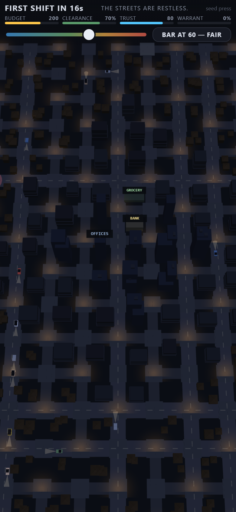

### 1. A deterministic city, validated before you see it *(done)*

Every match generates its street grid from a seed shown in the HUD — type it back in to replay a map exactly. Generation is validated against eight invariants (three distinct routes from the centre to an exit, no escape shorter than five observable segments, a straight run for the Long, arterial quotas, a syndicate district in its distance band, watcher-poles so cameras-watching-cameras is discoverable, bounded dead ends); failures re-roll deterministically and a golden seed is the last-resort fallback. `test_mapgen.js`: 200/200 seeds converge, zero fallbacks.

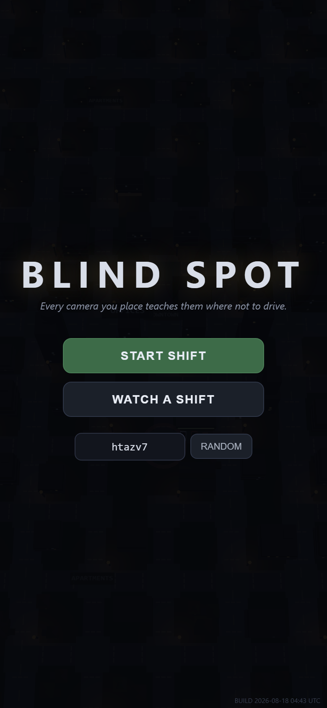

### 2. Cameras that produce information, not damage *(done — player-directed quadrant aiming)*

A Cyclops logs plates; it never stops anybody. Sightlines are geometry, not circles, and **buildings occlude** — vision runs along street corridors only, never through a block. The Post is **aimed at a quadrant at placement, forever** (two adjacent street rays, chosen with ↺ ↻ before CONFIRM — fixed-sector doctrine, its aim ticks shown on the unit for the rest of the match); the Long stares five blocks down one street; the Dome is the unaimed corner unit. Confidence is environmental and never random: distance, angle, road class, weather, lens condition. Placement — and aiming — is the skill, and the ghost's quality pill quotes what you'll get before you pay.

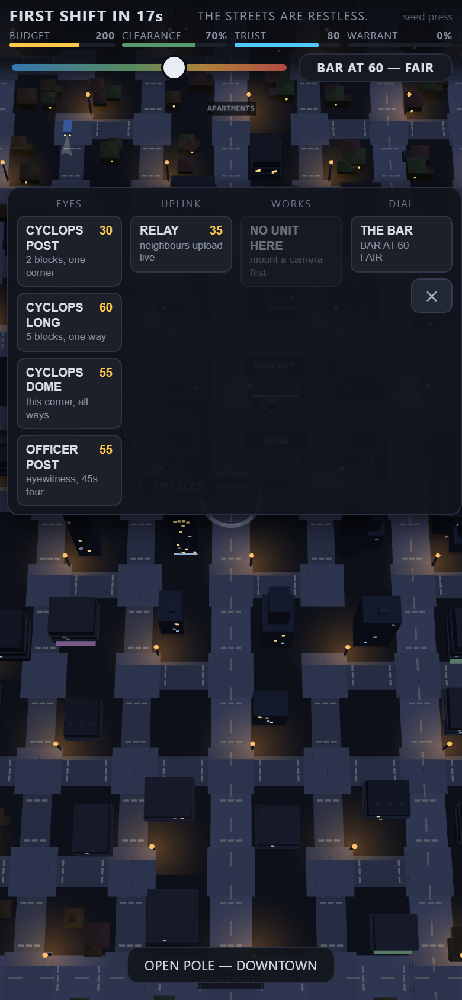 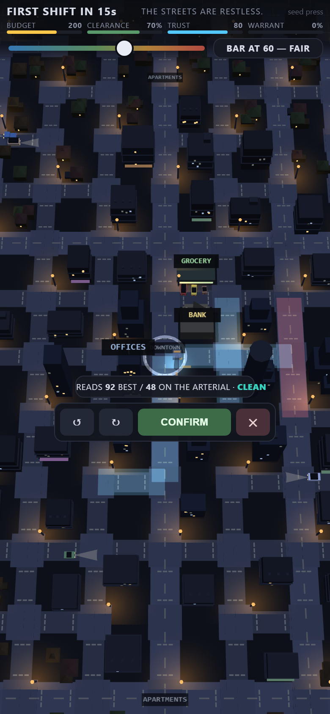

### 3. The threshold dial — the whole game in one control *(done)*

The bar is global, always visible, and always felt: every read flashes gold when it qualifies and grey when it misses, and moving the dial recolours every covered segment on the board at once (teal clears, amber marginal, red below). Rain drops the whole map's confidence and the bar's band label *doesn't move* — the divergence between what you asked for and what you're getting is the teaching moment.

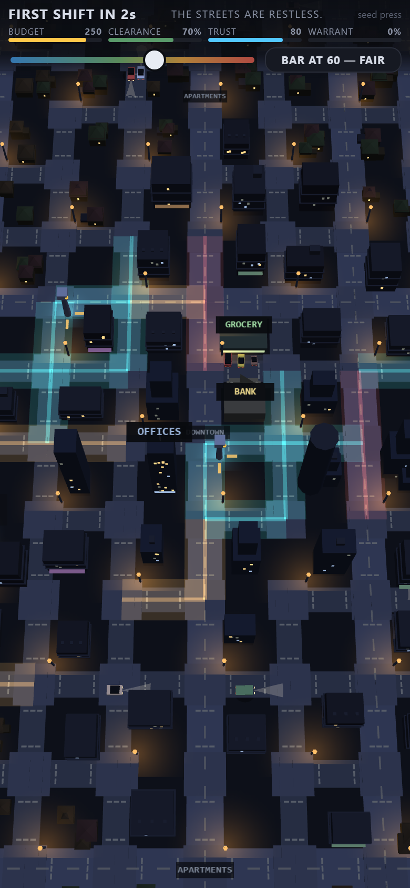 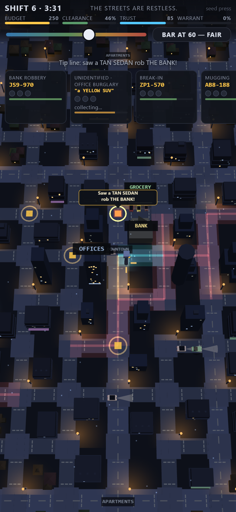

### 4. Cases, coherence, and the case file *(done — player-directed)*

Three corroborating reads spanning **multiple cameras**, anchored at the scene and tracing a drivable route, make an arrest; the file must then survive to trial. Contradictions never resolve silently — they surface a card you must CHARGE or RELEASE. Tap any open card and the **case file opens: a real 3D photograph for every read, rendered from the photographing Cyclops' own head into the live city** — the actual car on the actual street, its colour, body type and damage visible when the frame is good enough, the plate as the OCR took it with characters smudged in proportion to confidence, rain streaks, dirty-lens grease and light-scatter when the pole was tagged, CCTV scanlines. The header quotes the witness — **"a RED SUV"** — and the sheet holds the *whole* story: every frame the file ever had (aged-off, lost-with-pole, and still-unsent frames dimmed with status chips), a neighbourhood map of sightings over time with the legs drawn between them, and named diagnostics when a leg is impossible ("2 blocks in 0.1s — nothing drives that fast"). You can **pull a frame** you judge irrelevant — the map and diagnostics redraw without it, holding the button previews the what-if, and pulling is a toggle so you can restore. Excising a poisoned frame can clean a contested file and let the track close; excising your true frames is a new way to be wrong.

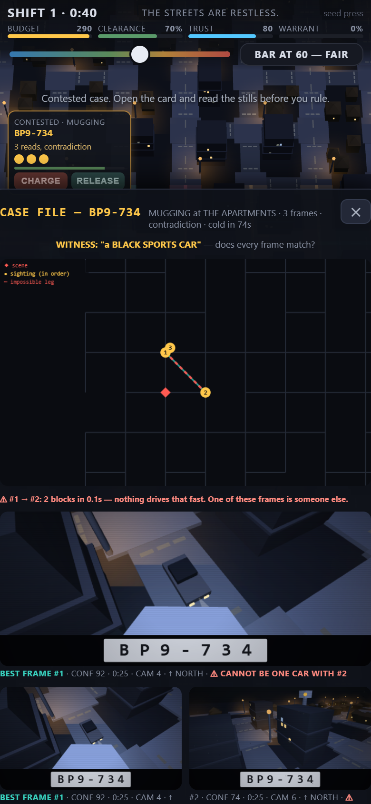 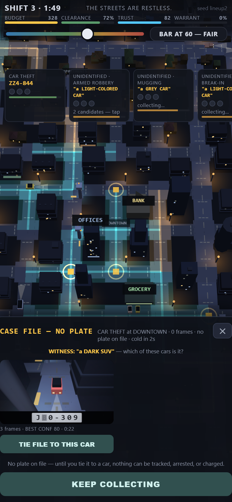

### 4½. No plate — just "a DARK SUV" *(done — player-directed)*

Some witnesses catch no plate. The file opens on the description alone, and **nothing can be tracked, arrested, or charged until you tie it to a car**: cameras near the scene collect a lineup of candidates matching the description, each presented as a real photo whose plate you can read exactly as well as the frame allows. Tie the file to the right car and the pipeline unlocks (the clock renews — the investigation properly starts at the lineup). Tie it to the wrong one and the real crew's reads stop helping you at all. Word bubbles pop at the scene with the witness's own words, and every crime keeps a pulsing marker on the map for the life of its file.

### 5. Evidence that dies twice *(done)*

Cameras hold reads on local drives and upload on a cycle — a scrapper who takes the pole thirty seconds before upload erases the evidence that was about to close your case, retroactively. Uploaded footage then ages off the drives on its own clock. A Relay removes the window for adjacent cameras; storage upgrades stretch the window; more memory or more eyes is a real recurring decision.

### 6. Vandals — and the camera that catches them *(done)*

Scrappers strip isolated poles for the panels; taggers foul lenses (a degraded camera doesn't stop working — it starts *lying*, dimmer reads and more false positives, worse than destroyed because you act on it); the Fixer blinds your best camera right before a syndicate job. The counterplay is the signature mechanic: a pole inside another camera's sightline is protected the only way this game protects anything — the vandalism gets **recorded**, the recording opens a case, and closing it takes the crew off the board with a bounty. Livelock-proofed with caps, retarget cooldowns, and abandon fallbacks (`test_vandals.js`).

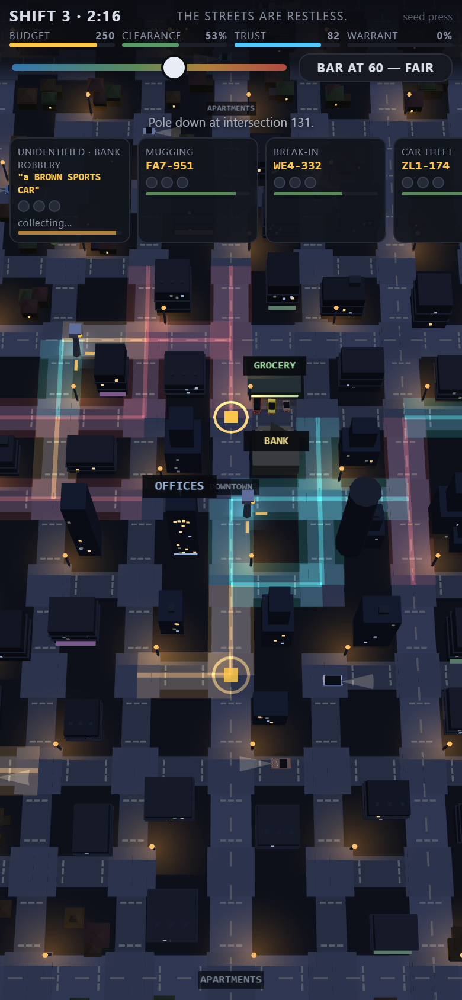

### 7. Crews learn your coverage *(done)*

A camera that reads a crew enters that crew's KNOWN set; future escape routes bend around it, dotted lines showing the detour. Your best camera decays in usefulness *because* it is your best camera — relocation (half price, deliberately routine) is the answer. Learning is capped and forgetful so a well-played match never empties, rate-limited so traffic never flickers, and provably fair: `test_crewfair.js` asserts crews know only cameras that actually read them. The AI never peeks at your placements.

### 8. The scripted shift-5 strike *(done — proven by test)*

By shift five you have a high-coverage camera carrying an in-progress syndicate case. The Fixer targets exactly it: the pole falls, its unsent reads evaporate, CASE AT RISK — and you have the rest of the file's life to re-cover the route or drop the bar so the syndicate's next run lands the closing read. Placement, retention, vandalism, the dial, and recovery in one sequence — `test_shift5.js` replays it end-to-end headlessly on three seeds, every build.

### 9. Every match ends *(done)*

Nine authored shifts on a compressing clock, then overtime escalates until the **Commissioner's Review** weighs warrant, clearance, trust, network integrity, and treasury — the printed scales make the ruling legible, and it can go against you. A **REFUSE — WORK ON** button declines either ruling; then only the warrant or a floor ends the matter. Census: 8 seeds, extended horizon, **0 timeouts**, worst case under ten minutes, both verdicts occurring.

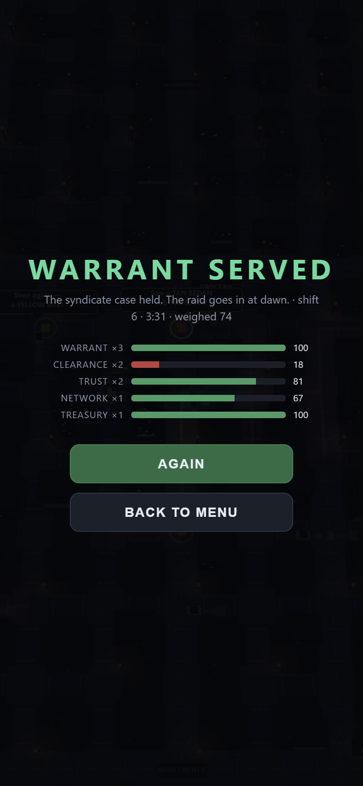

### 10. Onboarding that points *(done)*

A five-step tutorial with a pulsing ring and a pointing hand on the exact touch target, each step advancing on the real event (a placement, a read, a closure) with timeout fallbacks so nobody wedges; the shift clock holds while it runs. Once ever — SKIP for returners. Later teaching arrives just-in-time, one line, once ever, remembered across matches.

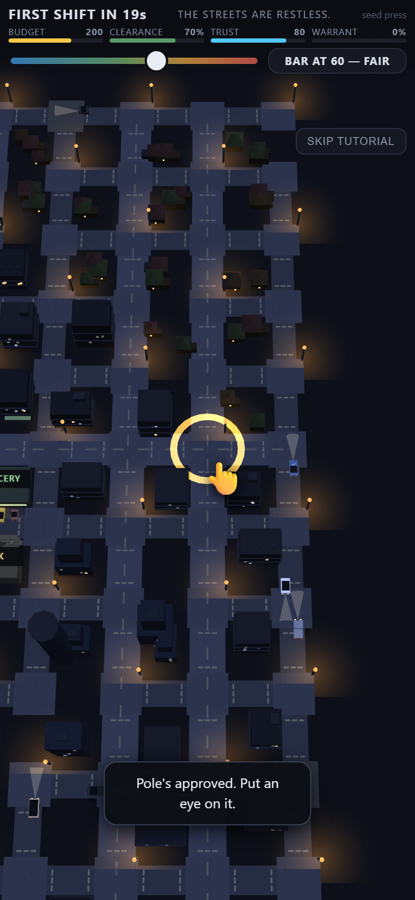

### 11. WATCH A SHIFT — a demonstrator that plays the real UI and wins *(done — genetically evolved)*

The title screen hands the desk to an AI that plays exactly the way you would: it opens the true tap menus, the button it means to press lights gold and pulses, ghosts walk CONFIRM, cards get visibly weighed and pressed, and the dial moves when rain comes. Its strategy is the champion of a **genetic search** (14 legible genes, ~1,300 headless matches): 4/5 holdout warrant wins vs 2/5 for the hand-authored player — and it was re-validated at the demo's one-action-at-a-time tempo before being allowed to drive, because a strategy evolved at headless act-rates is not automatically a strategy at UI tempo. Live, through the menus, it serves the warrant around shift 10. Any tap takes the desk back.

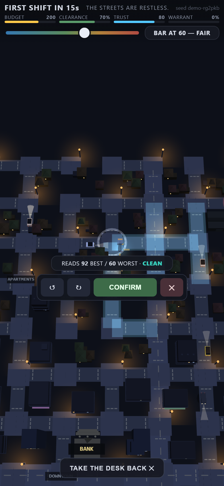

### 12. A four-tier city with a memory *(done — evolution-graded)*

Opponent pressure is a ladder — QUIET · RESTLESS · BRAZEN · LAWLESS — stepped silently one rung at a time by the same board-tally the Review weighs, and announced honestly in the HUD mood line ("THE STREETS ARE BRAZEN"). The hard tiers were graded by evolving the *opposition* against the champion (LAWLESS holds it to fitness 98 vs ~150 at baseline); the soft tiers are authored to protect a struggling analyst. The city remembers you across sessions (an EMA of your standing plus a decaying peak) — returning strong players are greeted by a brazen city from shift one.

### 13. Life happens — save & resume *(done)*

Lock your phone mid-shift: the full match snapshots on focus loss — cameras with their drive contents and upload timers, cases and evidence, crew memories, the shift clock. The map regenerates from the seed. The title offers **RESUME YOUR SHIFT — SHIFT N · seed**; a Playwright test proves the round trip exact (restore compared against the snapshot itself) and the resumed match alive. A build stamp on the title settles which-version-am-I-running at a glance.

### 14. Tuned by simulation, honestly *(done)*

A scripted trial player exercises every verb — places by site-scoring, moves the bar on rain and expiring evidence, adjudicates by evidence weight, relocates on idle coverage, buys storage against eyes. Five sweep harnesses price the constants it can honestly exercise: the bar's ridge is 50–60 (the trap punishes 45, starvation punishes 65+ — misread pressure was retuned when the first sweep showed a lax bar winning cleanly); lifetime×reads confirmed at 75×3; the start grid found **richer starts plateau lower** (120 optimal); bounty and retention flat within noise and honestly kept, not moved. Constants the script can't exercise are marked *judgment-tuned* in CONFIG, never presented as swept.
